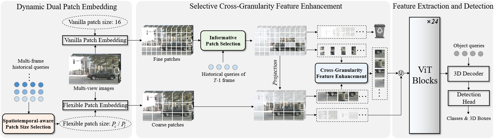

# Revisiting Token Compression for Accelerating ViT-based Sparse Multi-View 3D Object Detectors

<div align="center">

[Mingqian Ji](https://github.com/Mingqj) </sup>,
[Shanshan Zhang](https://shanshanzhang.github.io/) ✉</sup>,
[Jian Yang](https://scholar.google.com/citations?user=6CIDtZQAAAAJ&hl=zh-CN) </sup>

PCA Lab, School of Computer Science and Engineering, Nanjing University of Science and Technology

✉ Corresponding author

[](https://arxiv.org/abs/2604.14563)
[](https://www.apache.org/licenses/LICENSE-2.0)

</div>

## 📖 About

This repository represents the official implementation of the paper titled "Revisiting Token Compression for Accelerating ViT-based Sparse Multi-View 3D Object Detectors".

SEPatch3D is a dynamic patch-based framework for ViT-based multi-view 3D object detection that accelerates inference by adaptively adjusting patch sizes with Spatiotemporal-aware Patch Size Selection (SPSS), refining informative regions via Informative Patch Selection (IPS), and enhancing coarse features through Cross-Granularity Feature Enhancement (CGFE), achieving up to 57% faster inference while maintaining competitive detection accuracy.



## 💾 Main Results

**nuScenes val set**
| Config                                    | Runtime | mAP  | NDS |                                                Model                                                |
|:-----------------------------------------:|:------:|:----:|:----:|:--------------------------------------------------------------------------------------------------:|
| StreamPETR | 317.0   | 61.2 | 52.1 |-|
| [**SEPatch3D-fast**](projects/configs/StreamPETR/SEPatch3D_fast_l_stage2.py) |    250.2 (-21%)  | 61.2 | 52.1 |[Weights](https://drive.google.com/file/d/1UXfs4kmM-yVp55uyI_MPLqpSG3cTuCn4/view?usp=drive_link)|
| [**SEPatch3D-faster**](projects/configs/StreamPETR/SEPatch3D_faster_l_stage2.py) |    194.3 (-38%)  | 60.3 | 51.6 |[Weights](https://drive.google.com/file/d/1-X35YISlh0aYMgBxHk2QRRFU71mhBNGh/view?usp=drive_link)|
| StreamPETR↑ | 1309.0   | 62.7 | 55.8 |-|
| [**SEPatch3D-fast-1600**↑](projects/configs/StreamPETR/SEPatch3D_fast_l_1600_stage2.py) |    675.4 (-48%)   | 62.7 | 54.5 |[Weights](https://drive.google.com/file/d/14ikEUH-Nm1OUUjMPO-Ak1hFKyR_4DsiV/view?usp=drive_link)|
| [**SEPatch3D-faster-1600**↑](projects/configs/StreamPETR/SEPatch3D_faster_l_1600_stage2.py) |    554.4 (-57%)   | 62.4 | 54.2 |[Weights](https://drive.google.com/file/d/1r_KitnXrIIHTAMG6p0PxzBw0htaNGyXI/view?usp=drive_link)|

↑: image resolution is 640 × 1600.

## Get Started

#### 🛠️ Installation and Data Preparation

1. Please refer to [ToC3D](https://github.com/DYZhang09/ToC3D) and [StreamPETR](https://github.com/exiawsh/StreamPETR?tab=readme-ov-file) for environment preparation.
2. Prepare nuScenes dataset and create the pkl for SEPatch3D.

Notice: arrange the folder as:
```shell script
OcRFDet
    └──data
        └── nuscenes
            ├── v1.0-trainval
            ├── sweeps 
            ├── samples
            ├── nuscenes2d_temporal_infos_train_load.pkl
            └── nuscenes2d_temporal_infos_val_load.pkl
```

#### 🏋️ Train SEPatch model

The training process consists of two stages: 

Stage 1: Training flexivit 
```shell
# image resolution: 320 × 800
bash ./tools/dist_train.sh projects/configs/StreamPETR/stream_petr_eva_flexivit_fast_l_stage1.py 4
bash ./tools/dist_train.sh projects/configs/StreamPETR/stream_petr_eva_flexivit_faster_l_stage1.py 4

# image resolution: 640 × 1600
bash ./tools/dist_train.sh projects/configs/StreamPETR/stream_petr_eva_flexivit_fast_l_1600_stage1.py 4
bash ./tools/dist_train.sh projects/configs/StreamPETR/stream_petr_eva_flexivit_faster_l_1600_stage1.py 4

```

stage 2: Training IPS and CGFE
```shell
# image resolution: 320 × 800
bash ./tools/dist_train.sh projects/configs/StreamPETR/SEPatch3D_fast_l_stage2.py 4
bash ./tools/dist_train.sh projects/configs/StreamPETR/SEPatch3D_faster_l_stage2.py 4

# image resolution: 640 × 1600
bash ./tools/dist_train.sh projects/configs/StreamPETR/SEPatch3D_fast_l_1600_stage2.py 4
bash ./tools/dist_train.sh projects/configs/StreamPETR/SEPatch3D_faster_l_1600_stage2.py 4

```

#### 📋 Test SEPatch model
```shell
# image resolution: 320 × 800
bash ./tools/dist_test.sh projects/configs/StreamPETR/SEPatch3D_fast_l_stage2.py "./work_dirs/SEPatch3D_fast_l_stage2/SEPatch3D_fast_l.pth" 4 --eval mAP
bash ./tools/dist_test.sh projects/configs/StreamPETR/SEPatch3D_faster_l_stage2.py "./work_dirs/SEPatch3D_faster_l_stage2/SEPatch3D_faster_l.pth" 4 --eval mAP

# image resolution: 640 × 1600
bash ./tools/dist_test.sh projects/configs/StreamPETR/SEPatch3D_fast_l_1600_stage2.py "./work_dirs/SEPatch3D_fast_l_1600_stage2/SEPatch3D_fast_l_1600.pth" 4 --eval mAP
bash ./tools/dist_test.sh projects/configs/StreamPETR/SEPatch3D_faster_l_1600_stage2.py "./work_dirs/SEPatch3D_faster_l_1600_stage2/SEPatch3D_faster_l_1600.pth" 4 --eval mAP
```

## ❤️ Acknowledgement

We thank these great works and open-source codebases: [MMDetection3D](https://github.com/open-mmlab/mmdetection3d), [StreamPETR](https://github.com/exiawsh/StreamPETR?tab=readme-ov-file), [ToC3D](https://github.com/DYZhang09/ToC3D), [FlexiViT](https://github.com/bwconrad/flexivit).
